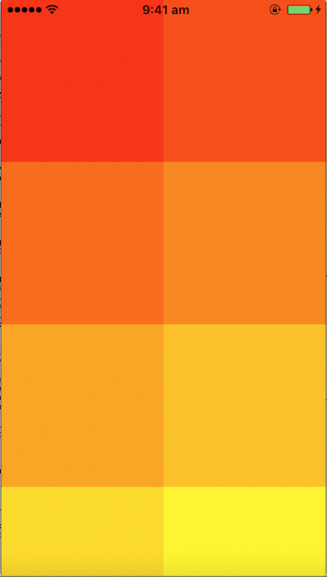
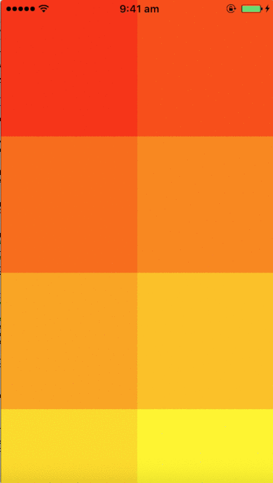

# FeedCollectionViewController

[](http://cocoapods.org/pods/FeedCollectionViewController)
[](http://cocoapods.org/pods/FeedCollectionViewController)
[](http://cocoapods.org/pods/FeedCollectionViewController)

A simple interface for creating data feeds so that data can be loaded
dynamically as the user scrolls. This is inspired by scrolling through photos
on Facebook or Instagram.

             

<sup>Images taken from the example project that uses colours in place of real content.</sup>

FeedCollectionViewController is a generic interface for setting up a simple
feed, whereas ImageFeedCollectionViewController is specifically set up for
images. ImageFeedCollectionViewController uses a [fork](https://github.com/oliveroneill/OOPhotoBrowser)
of [IDMPhotoBrowser](https://github.com/ideaismobile/IDMPhotoBrowser),
so that tapping on images lets you scroll through photos indefinitely.

## Example

To run the example project, clone the repo, and run `pod install` from the Example directory first.
The example project demonstrates the functionality without using any actual content, it creates
coloured images to illustrate its use with a large amount of content.

## Installation

FeedCollectionViewController is available through [CocoaPods](http://cocoapods.org). To install
FeedCollectionViewController, simply add the following line to your Podfile:

```ruby
pod "FeedCollectionViewController"
```

To install ImageFeedCollectionViewController, simply add the following line to
your Podfile:

```ruby
pod "ImageFeedCollectionViewController"
```

## Usage

The set up is quite similar to `UICollectionViewController`, you must specify a
reuse identifier and a `UICollectionViewCell` that should take its data from an
implemented `CellData`.

`FeedCollectionViewController`:

``` swift
    open func getReuseIdentifier(cell:CellData) -> String {
        // specifies the identifier of the cell, this can differ per cell
    }

    open func getCells(start:Int, callback: @escaping (([CellData]) -> Void)) {
        // get new cell data, this does not actually mean the cell is being shown
        // call `callback` with the new data. `start` is the query starting position
    }

    open func loadCell(cellView: UICollectionViewCell, cell:CellData) {
        // load the cell since it's now actually shown
    }
```

`ImageFeedCollectionViewController`:

``` swift
    open func getImageReuseIdentifier(cell: ImageCellData) -> String {
        // specifies the identifier of the cell, this can differ per cell
    }

    open func getImageCells(start:Int, callback: @escaping (([ImageCellData]) -> Void)) {
        // get new cell data, this does not actually mean the cell is being shown
        // call `callback` with the new data. `start` is the query starting position
    }

    open func loadImageCell(cellView: UICollectionViewCell, cell:ImageCellData) {
        // load the cell (ie. a thumbnail) since it's now actually shown
    }
```


## Testing
Testing is done through FBSnapshotTestCase, there are test result files included
in `Example/Tests/ReferenceImages_64/FeedCollectionViewController_Tests.Tests`.
These were run with iPhone SE Simulator, however you can re-run on your own
device by enabling `recordMode` in `setUp()` and then re-running the test with
it off.

## Todo
- Add default image for 404s
- Add ability to modify the single image view
- Better tests

## Author

Oliver O'Neill

## License

FeedCollectionViewController is available under the MIT license. See the LICENSE file for more info.
